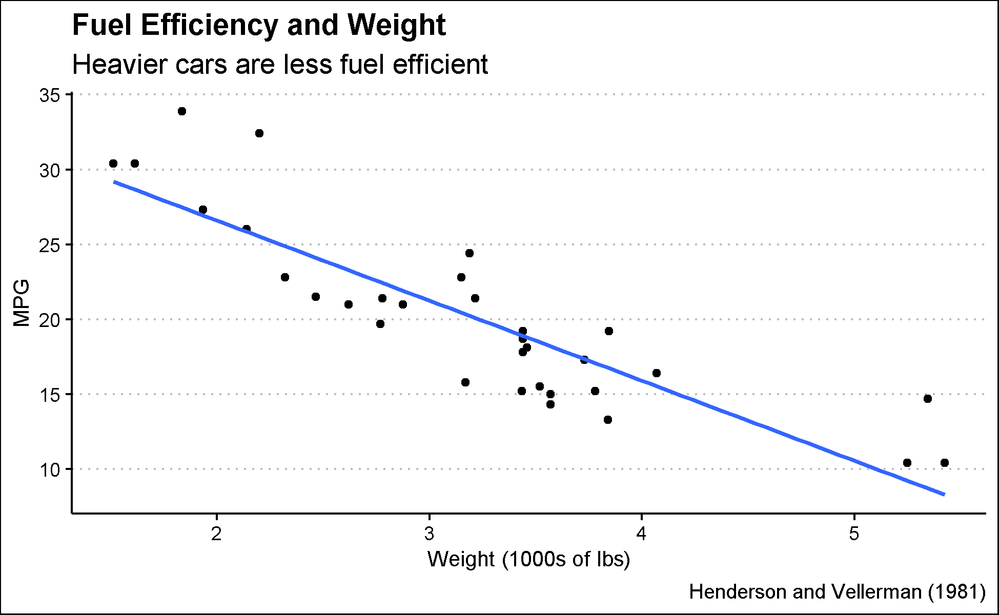

|                                                 |
|-------------------------------------------------|
| Title: "*Title of My Final Project*"              |
| Description: \|                                 |
| This is where I will describe my final project. |
| Site: distill::distill_website                  |

```{r setup, include=FALSE}
knitr::opts_chunk$set(echo = FALSE)
library(tidyverse)
library(ggthemes)
library(knitr)
```

```{r car-plot}
car_plot <- mtcars |> 
  select(mpg, wt) |> 
  # These are the x, y variables
  ggplot(aes(x = wt, y = mpg)) + 
  geom_point() + 
  geom_smooth(method = "lm", formula = y ~ x, se = FALSE) + 
  # Smooth allows you to see the perfect fit line
  theme_clean() + 
  labs(title = "Fuel Efficiency and Weight",
       subtitle = "Heavier cars are less fuel efficient",
       x = "Weight (1000s of lbs)", y = "MPG",
       caption = "Henderson and Vellerman (1981)")
write_rds(car_plot, "car-plot.rds")
car_plot <- read_rds("car-plot.rds" )
```

```{r}

```

